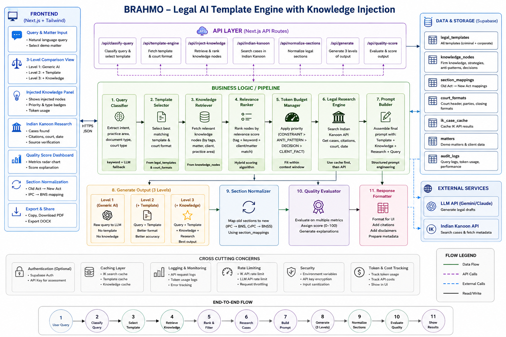
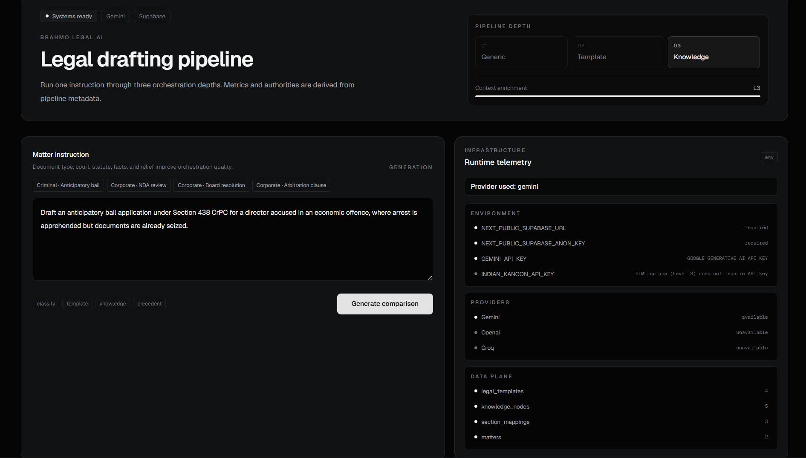
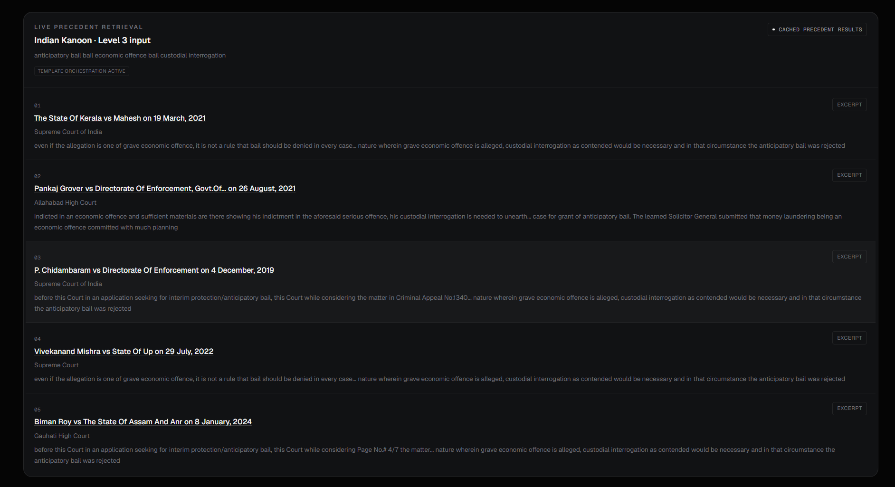
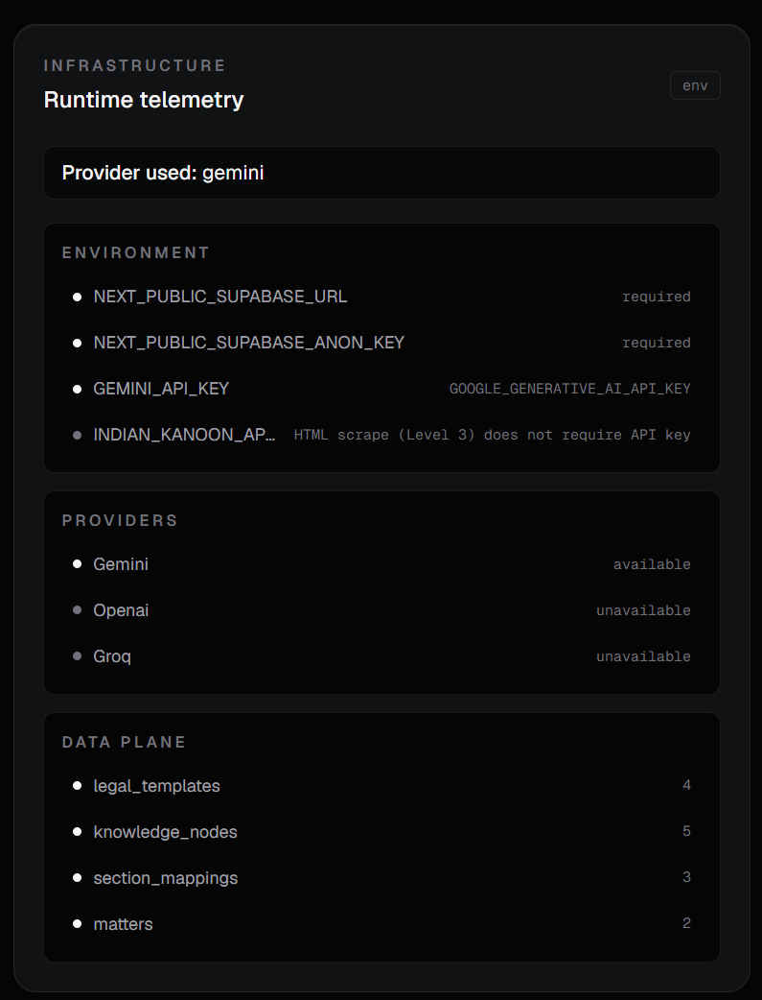

# BRAHMO Legal AI

<p align="center">
  
</p>

<h1 align="center">
BRAHMO — Legal AI Orchestration Platform
</h1>

<p align="center">
Enterprise-grade Legal AI system with Retrieval-Augmented Generation (RAG), Knowledge Injection, Indian Kanoon Research, and Multi-Level Legal Intelligence Pipelines.
</p>

---

<p align="center">


</p>

---

# Overview

BRAHMO Legal AI is a production-oriented Legal AI orchestration platform designed to demonstrate how AI systems progressively improve legal reasoning through:

- Retrieval-Augmented Generation (RAG)
- Knowledge Injection
- Template Orchestration
- Legal Authority Grounding
- Deterministic Evaluation
- Context-Aware Prompt Engineering
- Multi-Level Legal Intelligence

The system compares progressively intelligent AI drafting pipelines side-by-side to showcase how retrieval, templates, and contextual knowledge improve legal output quality.

---

# Key Features

## Multi-Level Legal Intelligence
- 3-level orchestration architecture
- side-by-side intelligence comparison
- deterministic evaluation pipeline
- trust-aware telemetry

---

## Retrieval-Augmented Generation (RAG)
- live Indian Kanoon retrieval
- legal authority extraction
- precedent injection
- contextual grounding

---

## Legal Workflow Automation
- anticipatory bail drafting
- NDA review
- arbitration clause generation
- board resolution drafting
- criminal law workflows
- corporate law workflows

---

## Knowledge Injection Engine
- strategic guidance injection
- legal constraint injection
- anti-pattern detection
- contextual intelligence retrieval

---

## Trust & Evaluation Layer
- grounding score
- reasoning score
- structural score
- retrieval score
- deterministic intelligence index

---

## Enterprise UI/UX
- monochrome enterprise design
- orchestration telemetry
- responsive dashboard
- animated transitions
- live comparison interface

---

# Architecture

## System Architecture

<p align="center">
  
</p>

---

# High-Level Pipeline

```text
User Query
   ↓
Query Classification
   ↓
Template Selection
   ↓
Knowledge Retrieval
   ↓
Relevance Ranking
   ↓
Indian Kanoon Research
   ↓
Prompt Orchestration
   ↓
3-Level Generation
   ↓
Section Normalization
   ↓
Deterministic Evaluation
   ↓
Final Response Rendering
```

---

# Technology Stack

| Layer | Technology |
|---|---|
| Frontend | Next.js 16 + React + TypeScript |
| Styling | TailwindCSS + Framer Motion |
| Backend | Next.js API Routes |
| Database | Supabase |
| AI | Google Gemini |
| Retrieval | Indian Kanoon |
| Validation | ESLint + TypeScript |
| Deployment | AWS EC2 (planned) |

---

# Core System Components

## Frontend Layer
- query dashboard
- 3-level comparison interface
- injected knowledge visualization
- telemetry & scoring panels
- live precedent viewer

---

## Backend API Layer
- query classification
- orchestration engine
- template selection
- knowledge injection
- precedent retrieval
- response normalization
- deterministic evaluation

---

## Retrieval & Knowledge Layer
- Indian Kanoon integration
- authority extraction
- contextual grounding
- legal knowledge graph
- strategic reasoning retrieval

---

## Supabase Storage Layer

| Table | Purpose |
|---|---|
| `legal_templates` | Legal drafting templates |
| `knowledge_nodes` | Strategic legal intelligence |
| `section_mappings` | IPC → BNS normalization |
| `court_formats` | Court-specific formatting |
| `ik_case_cache` | Indian Kanoon cache |
| `matters` | Matter storage |
| `audit_logs` | Telemetry & orchestration tracing |

---

# Legal Intelligence Levels

## Level 1 — Generic AI
- raw LLM generation
- no templates
- no retrieval
- no contextual grounding

### Characteristics
- weak reasoning
- inconsistent formatting
- low legal reliability

---

## Level 2 — Template Intelligence
- template-guided orchestration
- structured drafting
- improved formatting
- moderate legal reasoning

### Enhancements
- legal sectioning
- formatting consistency
- reduced hallucinations

---

## Level 3 — Grounded Legal Intelligence
- live precedent retrieval
- knowledge graph injection
- strategic legal reasoning
- contextual grounding
- trust-aware orchestration

### Advanced Capabilities
- authority-backed drafting
- contextual legal intelligence
- explainable orchestration
- deterministic evaluation

---

# Indian Kanoon Integration

BRAHMO integrates live Indian Kanoon retrieval to:
- search precedents
- extract citations
- retrieve court metadata
- inject relevant legal principles
- improve contextual grounding

## Features
- retrieval caching
- timeout handling
- graceful fallback orchestration
- citation parsing
- authority separation

---

# Trust & Telemetry

BRAHMO uses deterministic evaluation instead of arbitrary AI scoring.

## Evaluation Metrics

| Metric | Description |
|---|---|
| Structure | Formatting quality |
| Reasoning | Legal reasoning sophistication |
| Grounding | Retrieval & authority grounding |
| Retrieval | Precedent utilization |
| Citation | Citation relevance |
| Intelligence | Overall orchestration quality |

---

# Screenshots

## Main Dashboard

<p align="center">
  
</p>

---

## 3-Level Comparison

<p align="center">
  
</p>

---

## Indian Kanoon Retrieval

<p align="center">
  
</p>

---

## Telemetry Dashboard

<p align="center">
  
</p>

---

# Example Queries

## Criminal Law

### Anticipatory Bail

```text
Draft anticipatory bail for a director accused in an economic offence where arrest is apprehended but documents are already seized.
```

---

### White Collar Offence

```text
Draft bail arguments in a money laundering investigation involving alleged shell companies.
```

---

## Corporate Law

### NDA Review

```text
Review and tighten a mutual NDA for a SaaS vendor engagement.
```

---

### Arbitration Clause

```text
Draft an arbitration clause with seat Mumbai for a shareholders agreement.
```

---

### Board Resolution

```text
Draft a board resolution approving appointment of an additional director.
```

---

# Local Development Setup

## Clone Repository

```bash
git clone <repository-url>
cd brahmo-legal-ai
```

---

## Install Dependencies

```bash
npm install
```

---

## Configure Environment Variables

Create:

```bash
.env.local
```

Copy:

```bash
cp .env.example .env.local
```

---

## Add API Keys

```env
# Supabase
NEXT_PUBLIC_SUPABASE_URL=
NEXT_PUBLIC_SUPABASE_ANON_KEY=
SUPABASE_SERVICE_ROLE_KEY=

# Gemini
GEMINI_API_KEY=
GOOGLE_GENERATIVE_AI_API_KEY=

# Indian Kanoon
INDIAN_KANOON_API_KEY=
```

---

# Supabase Setup

## Create Project
Create a new project at:

```text
https://supabase.com/
```

---

## Run Schema

```sql
schema.sql
```

---

## Run Seed

```sql
seed.sql
```

---

# Run Development Server

```bash
npm run dev
```

Open:

```text
http://localhost:3000
```

---

# Validation

```bash
npm run lint
npx tsc --noEmit
npm run build
```

---

# Engineering Highlights

## Retrieval-Augmented Generation
- contextual grounding
- precedent injection
- authority retrieval

---

## Knowledge Graph Orchestration
- strategic guidance retrieval
- anti-pattern detection
- legal intelligence injection

---

## Trust-Aware UX
- provenance separation
- retrieval transparency
- deterministic telemetry

---

## Production Engineering
- modular architecture
- TypeScript safety
- caching layer
- graceful fallback handling
- token-aware orchestration

---

# Deployment Architecture (Planned)

| Layer | Service |
|---|---|
| Compute | AWS EC2 |
| Reverse Proxy | Nginx |
| Process Manager | PM2 |
| Database | Supabase |
| SSL | Let's Encrypt |

---

# Validation Status

| Validation | Status |
|---|---|
| ESLint | ✅ |
| TypeScript | ✅ |
| Production Build | ✅ |
| Supabase Integration | ✅ |
| Gemini Integration | ✅ |
| Indian Kanoon Retrieval | ✅ |
| RAG Pipeline | ✅ |

---

# Future Improvements

- PDF export
- DOCX generation
- authentication layer
- semantic retrieval
- vector embeddings
- advanced legal analytics
- multi-jurisdiction support

---

# Author

## Pardiv Reddy

AI Engineer • Full Stack Developer • Legal AI Systems

---

# License

Assessment / Demonstration Purpose Only.