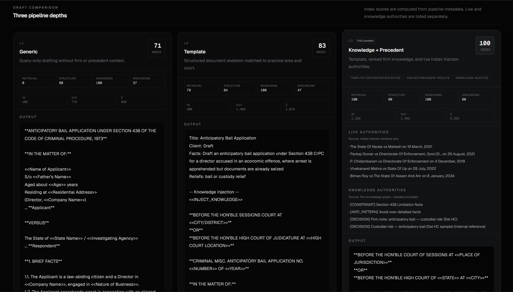
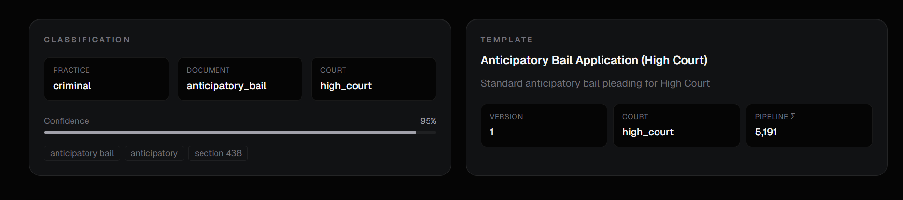
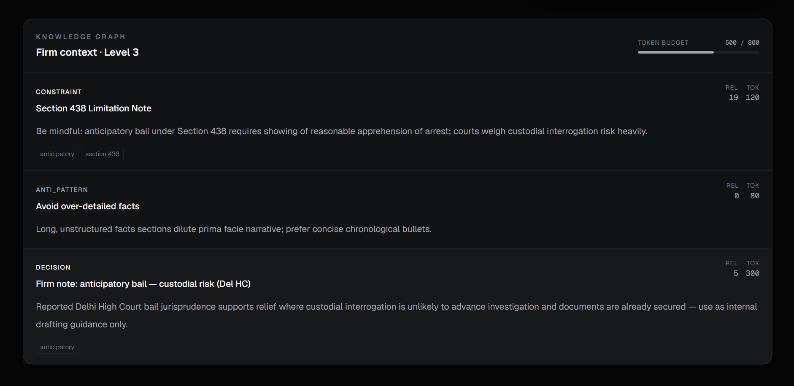

# BRAHMO Legal AI
<h1 align="center">
BRAHMO — Legal AI Orchestration Platform
</h1>

<p align="center">
A technical legal AI system that combines retrieval grounding, institutional knowledge injection, and multi-provider orchestration for Indian legal drafting.
</p>

---

<p align="center">


</p>

---

# Overview

BRAHMO Legal AI is a technical orchestration platform for legal document generation. It is designed to bridge the gap between raw LLM output and usable Indian legal drafting by combining:

- query classification,
- active template orchestration,
- live Indian Kanoon precedent retrieval,
- firm-level knowledge injection,
- provider fallback and telemetry.

Generic LLMs alone are insufficient for legal drafting because they lack document structure, precedent traceability, and task-specific reliability. BRAHMO addresses that by making each stage explicit, auditable, and progressively stronger.

See `ARCHITECTURE_NOTES.md` for a detailed architecture and orchestration walkthrough.

---

# Key Capabilities

## Multi-Level Legal Intelligence
- 3-stage generation pipeline (Generic → Template → Grounded)
- side-by-side draft comparison
- transparent intelligence scoring
- explicit trust signals for review

---

## Grounded Retrieval
- live Indian Kanoon precedent search
- structured case metadata extraction
- retrieval caching and graceful fallback
- precedent-aware prompt orchestration

---

## Institutional Knowledge
- Supabase-backed legal knowledge nodes
- constraint, anti-pattern, and strategy injection
- relevance scoring across practice tags
- token-budgeted contextual guidance

---

## Provider Resilience
- multi-provider AI orchestration
- primary Gemini execution with OpenAI/Groq/Claude fallback
- quota-aware routing and degraded mode handling
- circuit breaker and provider telemetry

---

## Legal Draft Consistency
- template selection by practice area and court type
- structured format and section ordering
- IPC/CrPC normalization to modern code labels
- deterministic evaluation of outputs

---

# Architecture

## System Architecture

<p align="center">
  
</p>

---

# High-Level Pipeline

```text
User Query
  ↓
Query Classification
  ↓
Template Selection
  ↓
Knowledge Retrieval
  ↓
Indian Kanoon Retrieval
  ↓
Prompt Construction
  ↓
L1 / L2 / L3 Generation
  ↓
Section Normalization
  ↓
Grounding Validation
  ↓
UI Rendering
```

---

# Technology Stack

| Category | Technology |
|---|---|
| Frontend | Next.js 16, React, TypeScript |
| Styling | TailwindCSS, Framer Motion |
| API | Next.js Route Handlers |
| Database | Supabase |
| Primary AI | Google Gemini |
| Fallback AI | OpenAI, Groq, Claude |
| Retrieval | Indian Kanoon |
| Validation | ESLint, TypeScript |

---

# Core System Components

## Frontend Layer
- query dashboard and demo presets
- 3-level comparison interface
- grounding validation and telemetry panels
- live precedent and knowledge views

---

## Backend API Layer
- classification and template selector
- orchestrated generation pipeline
- knowledge injection and retrieval orchestration
- section normalization and output shaping
- response payload assembly for UI rendering

---

## Retrieval & Knowledge Layer
- Indian Kanoon case search and cache
- authority extraction and metadata parsing
- legal knowledge graph ranking
- court format reference handling

---

## Storage Layer
- `legal_templates` for scaffolding drafts
- `knowledge_nodes` for institutional intelligence
- `section_mappings` for statutory modernization
- `ik_case_cache` for retrieval efficiency
- `matters` for optional matter state

---

# Legal Intelligence Levels

## Level 1 — Generic AI
- pure query-driven draft
- no templates
- no retrieval
- baseline comparison output

### Purpose
L1 exposes raw model behavior and provides a baseline for measuring what structure and grounding add.

---

## Level 2 — Template Intelligence
- template-guided orchestration
- structured drafting
- improved formatting
- moderate legal reasoning

### Purpose
L2 ensures legal document form and reduces drift by enforcing section order and court-aware structure.

---

## Level 3 — Grounded Legal Intelligence
- live precedent retrieval
- knowledge graph injection
- strategic legal reasoning
- contextual grounding
- explicit trust signals

### Purpose
L3 is more reliable than L1 because it is anchored in precedent and firm knowledge, not only model completion.

---

# Grounding Validation

The system surfaces orchestration transparency through explicit pipeline signals and UI panels. Key validation areas:

- authority visibility: live precedents retrieved and cached,
- knowledge visibility: legal nodes injected into prompts,
- template visibility: selected document scaffold,
- provider visibility: model and fallback state,
- normalization visibility: section modernization checks.

This makes review easier by turning model behavior into audit-ready signals.

---

# AI Provider Orchestration

BRAHMO uses a provider abstraction layer for model routing and fallback. It supports:

- Gemini as the primary model,
- optional OpenAI / Groq / Claude fallback,
- quota-aware provider selection,
- circuit breaker for repeated failures,
- degraded mode visibility,
- provider-level metrics and tracing.

Why multi-provider orchestration improves reliability:

- avoids single-provider outages,
- preserves availability under rate limits,
- exposes fallback decisions for operational review.

---

# Screenshots

## Main Dashboard

<p align="center">
  
</p>

---

## 3-Level Comparison

<p align="center">
  
</p>

---

## Template & Classification

<p align="center">
  
</p>

---

## Indian Kanoon Retrieval

<p align="center">
  
</p>

---

## Knowledge Graph

<p align="center">
  
</p>

---

# Project Structure

```
src/
  app/                # Next.js page and API route entrypoints
  components/         # UI panels and validation views
  lib/                # orchestration, retrieval, prompts, utilities
  lib/ai/             # provider abstraction and orchestration core
  lib/ai/providers/   # Gemini, OpenAI, Groq, Claude adapters
  lib/ai/orchestration/ # fallback, quota, circuit-breaker, metrics
  types/              # shared legal and generation type definitions
assets/               # architecture diagram and screenshot assets
public/               # static public assets
```

---

# Setup

## Install

```bash
npm install
```

## Run locally

```bash
npm run dev
```

## Build

```bash
npm run build
npm run start
```

---

# Environment Variables

```text
NEXT_PUBLIC_SUPABASE_URL
NEXT_PUBLIC_SUPABASE_ANON_KEY
SUPABASE_SERVICE_ROLE_KEY
GEMINI_API_KEY (or GOOGLE_GENERATIVE_AI_API_KEY)
OPENAI_API_KEY
GROQ_API_KEY
CLAUDE_API_KEY
INDIAN_KANOON_API_KEY
```

> `INDIAN_KANOON_API_KEY` enables live precedent retrieval. If not configured, the system can still run with retrieval disabled.

---

# Deployment

The project is designed for a standard Node deployment stack:

- build with `npm run build`
- run as a managed Node process
- use PM2 or equivalent process manager
- expose through Nginx for TLS and proxy routing
- host on AWS EC2 or equivalent infrastructure

Keep provider and Supabase credentials isolated in environment variables.

---

# Roadmap

Planned improvements:

- embedding-based retrieval and semantic search,
- semantic reranking for precedent relevance,
- vector-backed legal knowledge retrieval,
- lawyer feedback loops for matter refinement,
- persistent matter memory and client context,
- advanced evaluation metrics for content accuracy.

---

# Example Query

```text
Draft anticipatory bail for a director accused in an economic offence where arrest is apprehended but documents are already seized.
```

---

# Notes

This repository is built as an AI systems demonstration for legal drafting orchestration. It focuses on making model outputs auditable, grounded, and structurally consistent rather than on broad product messaging.
