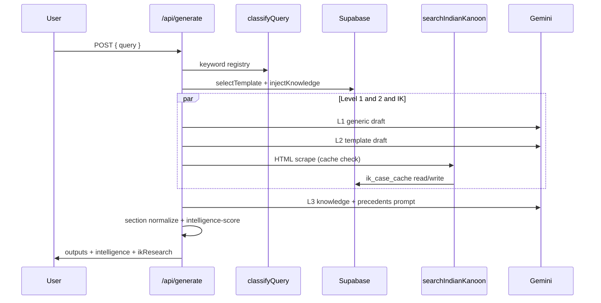

# BRAHMO Legal AI — Architecture Document

> **Version:** 1.0.0
> **Last Updated:** 2026-05-25
> **Status:** Living Document

---

## Table of Contents

1. [System Overview](#1-system-overview)
2. [Tech Stack](#2-tech-stack)
3. [Data Flow](#3-data-flow)
4. [The 3 AI Generation Levels](#4-the-3-ai-generation-levels)
5. [IPC → BNS Section Normalization](#5-ipc--bns-section-normalization)
6. [Extensibility — Data-Driven Registry Pattern](#6-extensibility--data-driven-registry-pattern)
7. [Folder Structure](#7-folder-structure)
8. [Key Design Decisions](#8-key-design-decisions)

---

## 1. System Overview

**BRAHMO Legal AI** is a **Template + Knowledge Injection Engine** designed for the Indian legal system. It combines structured legal templates with a dynamic knowledge graph to produce court-ready legal documents across multiple practice areas.

### Core Philosophy

Traditional legal AI systems rely on a single monolithic prompt to generate documents. BRAHMO takes a fundamentally different approach:

```
┌─────────────────────────────────────────────────────────────────┐
│                        User Query                               │
│            "Draft anticipatory bail application for             │
│             Section 420 IPC in Delhi High Court"                │
└──────────────────────────┬──────────────────────────────────────┘
                           │
                           ▼
              ┌────────────────────────┐
              │  Query Classification  │
              │  • Practice Area       │
              │  • Document Type       │
              │  • Court Type          │
              └──────────┬─────────────┘
                         │
            ┌────────────┼────────────┐
            ▼            ▼            ▼
     ┌────────────┐ ┌──────────┐ ┌──────────────┐
     │  Template   │ │Knowledge │ │ Indian Kanoon│
     │  Selection  │ │Injection │ │   Search     │
     └─────┬──────┘ └────┬─────┘ └──────┬───────┘
           │              │              │
           └──────────────┼──────────────┘
                          ▼
              ┌────────────────────────┐
              │   3-Level AI Engine    │
              │  Level 1: Generic AI   │
              │  Level 2: Template AI  │
              │  Level 3: Knowledge AI │
              └──────────┬─────────────┘
                         │
                         ▼
              ┌────────────────────────┐
              │  Court-Formatted       │
              │  Legal Document        │
              └────────────────────────┘
```

### Key Differentiators

| Feature | Traditional Legal AI | BRAHMO |
|---------|---------------------|--------|
| Template handling | Hardcoded | Data-driven, extensible |
| Knowledge base | Static prompts | Dynamic injection from DB |
| Case law | Manual lookup | Automated via Indian Kanoon |
| Section mapping | None | IPC ↔ BNS normalization |
| Court formatting | Generic | Court-specific headers/footers |
| New practice areas | Code changes required | Add rows to database |

---

## 2. Tech Stack

### Frontend & Framework

| Technology | Purpose | Version |
|-----------|---------|---------|
| **Next.js** (App Router) | Full-stack React framework | Latest |
| **TypeScript** | Type safety across the stack | 5.x |
| **Tailwind CSS** | Utility-first styling | 4.x |
| **React** | UI components | 19.x |

### Backend & Data

| Technology | Purpose |
|-----------|---------|
| **Supabase** | PostgreSQL database, auth, real-time, storage |
| **Supabase Edge Functions** | Serverless compute for heavy processing |
| **PostgreSQL** | Primary data store with JSONB support |

### AI & External APIs

| Technology | Purpose |
|-----------|---------|
| **Google Gemini API** | Multi-level AI text generation |
| **Indian Kanoon API** | Case law search and retrieval |

### Infrastructure

| Technology | Purpose |
|-----------|---------|
| **Vercel** | Frontend deployment and edge functions |
| **Supabase Cloud** | Managed PostgreSQL and auth |
| **pnpm** | Package management |

---

## 3. Data Flow

### End-to-End Request Lifecycle

```
Step 1: QUERY CLASSIFICATION
─────────────────────────────
User input → NLP/keyword analysis → {practice_area, document_type, court_type, confidence}

Step 2: TEMPLATE SELECTION
─────────────────────────────
classification → DB query → best-match template with variables and structure

Step 3: KNOWLEDGE INJECTION
─────────────────────────────
classification → fetch relevant KnowledgeNodes → rank by priority and relevance tags
→ inject procedures, precedents, statutes, practice tips into context

Step 4: INDIAN KANOON SEARCH
─────────────────────────────
Extract legal keywords → check ik_case_cache → if miss, call IK API
→ parse results → cache for 7 days → attach relevant case citations

Step 5: 3-LEVEL AI GENERATION
─────────────────────────────
Level 1 (Generic AI):    query alone → Gemini → raw legal output
Level 2 (Template AI):   query + template → Gemini → structured output
Level 3 (Knowledge AI):  query + template + knowledge + cases → Gemini → production output

Step 6: COURT FORMATTING
─────────────────────────────
Apply court_format rules → add header/footer → normalize section references (IPC→BNS)
→ final court-ready document
```

### Detailed Flow Diagram

```
┌──────┐    ┌───────────────┐    ┌──────────────────┐    ┌──────────────┐
│ User │───▶│ /api/generate │───▶│ classifyQuery()  │───▶│ Supabase DB  │
└──────┘    └───────────────┘    └────────┬─────────┘    └──────┬───────┘
                                          │                      │
                                          ▼                      │
                                 ┌────────────────┐              │
                                 │ selectTemplate │◀─────────────┘
                                 └────────┬───────┘
                                          │
                                 ┌────────▼────────┐    ┌──────────────┐
                                 │ injectKnowledge │───▶│ KnowledgeDB  │
                                 └────────┬────────┘    └──────────────┘
                                          │
                                 ┌────────▼────────┐    ┌──────────────┐
                                 │ searchCaseLaw   │───▶│ Indian Kanoon│
                                 └────────┬────────┘    └──────────────┘
                                          │
                                 ┌────────▼────────┐    ┌──────────────┐
                                 │ generateOutput  │───▶│  Gemini API  │
                                 │ (3 levels)      │    └──────────────┘
                                 └────────┬────────┘
                                          │
                                 ┌────────▼────────┐
                                 │ formatForCourt  │
                                 └────────┬────────┘
                                          │
                                          ▼
                                 ┌────────────────┐
                                 │  Final Output   │
                                 └────────────────┘
```

---

## 4. The 3 AI Generation Levels

BRAHMO uses a **progressive enrichment** strategy. Each level builds upon the previous one, allowing users to see the incremental value of templates and injected knowledge.

### Level 1: Generic AI

```
Input:  User query (raw text)
Model:  Gemini
Output: Best-effort legal text without structural guidance
```

- **Purpose:** Baseline output; shows what a general-purpose AI produces
- **Strengths:** Fast, handles novel queries
- **Weaknesses:** May lack proper legal structure, miss jurisdiction-specific nuances
- **Use Case:** Quick drafts, brainstorming, queries with no matching template

### Level 2: Template AI

```
Input:  User query + matched LegalTemplate (structure, variables, placeholders)
Model:  Gemini
Output: Structured legal document following the template format
```

- **Purpose:** Structurally correct documents following established legal formats
- **Strengths:** Consistent formatting, proper sections, court-appropriate structure
- **Weaknesses:** May miss practice-specific knowledge and recent precedents
- **Use Case:** Standard legal documents where format compliance is critical

### Level 3: Template + Knowledge AI

```
Input:  User query + LegalTemplate + KnowledgeNodes + Indian Kanoon cases
Model:  Gemini
Output: Comprehensive, citation-rich, practice-area-aware legal document
```

- **Purpose:** Production-quality output with deep legal knowledge
- **Strengths:** Relevant precedents, procedural accuracy, practice tips, case citations
- **Weaknesses:** Slower (multiple DB lookups + API calls), higher token usage
- **Use Case:** Final client-facing documents, court filings, thorough legal research

### Side-by-Side Comparison UI

The UI renders all three levels simultaneously, allowing lawyers to:
1. Compare the quality improvement at each level
2. Cherry-pick sections from different levels
3. Understand the value of template + knowledge injection

---

## 5. IPC → BNS Section Normalization

India transitioned from the **Indian Penal Code (IPC)** to the **Bharatiya Nyaya Sanhita (BNS)** effective July 1, 2024. BRAHMO handles this transition transparently.

### How It Works

```
┌───────────────────┐     ┌──────────────────────┐     ┌───────────────────┐
│   User mentions   │────▶│  section_mappings    │────▶│  Output includes  │
│   "Section 302    │     │  table lookup        │     │  both references  │
│    IPC"           │     │  302 → 103           │     │  "Section 302 IPC │
└───────────────────┘     └──────────────────────┘     │   (now Section    │
                                                       │   103 BNS)"       │
                                                       └───────────────────┘
```

### Key Features

- **Bidirectional mapping:** IPC → BNS and BNS → IPC
- **Database-driven:** New mappings can be added without code changes
- **Context-aware:** Applies mappings based on document date and court requirements
- **Comprehensive:** Covers all major penal sections including:
  - IPC 302 → BNS 103 (Murder)
  - IPC 376 → BNS 64 (Rape)
  - IPC 420 → BNS 316 (Cheating)
  - IPC 498A → BNS 84 (Cruelty by husband)
  - And 100+ more mappings

### Also Covered

| Old Legislation | New Legislation |
|----------------|-----------------|
| Indian Penal Code (IPC) | Bharatiya Nyaya Sanhita (BNS) |
| Code of Criminal Procedure (CrPC) | Bharatiya Nagarik Suraksha Sanhita (BNSS) |
| Indian Evidence Act (IEA) | Bharatiya Sakshya Adhiniyam (BSA) |

---

## 6. Extensibility — Data-Driven Registry Pattern

BRAHMO is designed so that **adding a new practice area requires zero code changes**. Everything is driven by database records.

### Adding a New Practice Area (e.g., "Family Law")

```sql
-- Step 1: Add templates
INSERT INTO legal_templates (practice_area, document_type, title, template_body, variables)
VALUES ('family', 'divorce_petition', 'Divorce Petition under Hindu Marriage Act', '...', '[...]');

-- Step 2: Add knowledge nodes
INSERT INTO knowledge_nodes (practice_area, category, title, content, citations)
VALUES ('family', 'procedure', 'Divorce Filing Procedure', '...', '[...]');

-- Step 3: Done! The system auto-discovers new practice areas.
```

### How Auto-Discovery Works

```typescript
// The system queries available practice areas dynamically
const practiceAreas = await supabase
  .from('legal_templates')
  .select('practice_area')
  .eq('is_active', true)
  .distinct();

// Templates are selected by matching classification results
const template = await supabase
  .from('legal_templates')
  .select('*')
  .eq('practice_area', classification.practice_area)
  .eq('document_type', classification.document_type)
  .eq('is_active', true)
  .order('version', { ascending: false })
  .limit(1)
  .single();
```

### Registry Pattern Benefits

| Benefit | How |
|---------|-----|
| **No redeployment** | Add data via Supabase dashboard or SQL |
| **Version control** | Templates have `version` field; always use latest |
| **A/B testing** | Multiple active templates, toggle `is_active` |
| **Audit trail** | `created_at` / `updated_at` timestamps on all records |
| **Gradual rollout** | Activate templates per practice area independently |

---

## 7. Folder Structure

```
brahmo-legal-ai/
├── .env.example                    # Environment variable template
├── .env.local                      # Local environment (gitignored)
├── next.config.ts                  # Next.js configuration
├── tailwind.config.ts              # Tailwind CSS configuration
├── tsconfig.json                   # TypeScript configuration
├── package.json                    # Dependencies and scripts
│
├── docs/
│   ├── architecture.md             # This document
│   └── case_sources.md             # Indian Kanoon integration guide
│
├── supabase/
│   ├── schema.sql                  # Database schema (DDL)
│   ├── seed.sql                    # Initial seed data
│   └── migrations/                 # Incremental schema migrations
│
├── src/
│   ├── app/                        # Next.js App Router
│   │   ├── layout.tsx              # Root layout
│   │   ├── page.tsx                # Landing / home page
│   │   ├── (auth)/                 # Auth route group
│   │   │   ├── login/page.tsx
│   │   │   └── register/page.tsx
│   │   ├── dashboard/              # Main dashboard
│   │   │   └── page.tsx
│   │   ├── generate/               # Document generation UI
│   │   │   └── page.tsx
│   │   ├── matters/                # Matter management
│   │   │   ├── page.tsx
│   │   │   └── [id]/page.tsx
│   │   └── api/                    # API routes
│   │       ├── generate/route.ts   # AI generation endpoint
│   │       ├── classify/route.ts   # Query classification
│   │       ├── templates/route.ts  # Template CRUD
│   │       ├── knowledge/route.ts  # Knowledge node queries
│   │       ├── cases/route.ts      # Indian Kanoon proxy
│   │       └── sections/route.ts   # IPC↔BNS mappings
│   │
│   ├── components/                 # Reusable UI components
│   │   ├── ui/                     # Base UI primitives
│   │   ├── legal/                  # Legal-domain components
│   │   │   ├── TemplateViewer.tsx
│   │   │   ├── KnowledgePanel.tsx
│   │   │   ├── CaseCitationCard.tsx
│   │   │   ├── SectionMapper.tsx
│   │   │   └── ThreeLevelOutput.tsx
│   │   └── layout/                 # Layout components
│   │       ├── Header.tsx
│   │       ├── Sidebar.tsx
│   │       └── Footer.tsx
│   │
│   ├── lib/                        # Core library code
│   │   ├── supabase/
│   │   │   ├── client.ts           # Browser Supabase client
│   │   │   ├── server.ts           # Server Supabase client
│   │   │   └── middleware.ts       # Auth middleware
│   │   ├── ai/
│   │   │   ├── gemini.ts           # Gemini API wrapper
│   │   │   ├── classifier.ts       # Query classification logic
│   │   │   ├── generator.ts        # 3-level generation engine
│   │   │   └── prompts.ts          # Prompt templates
│   │   ├── legal/
│   │   │   ├── templates.ts        # Template selection & rendering
│   │   │   ├── knowledge.ts        # Knowledge injection engine
│   │   │   ├── sections.ts         # IPC↔BNS normalization
│   │   │   └── court-format.ts     # Court-specific formatting
│   │   ├── indian-kanoon/
│   │   │   ├── client.ts           # IK API client
│   │   │   ├── parser.ts           # Result parsing
│   │   │   └── cache.ts            # Cache layer
│   │   └── utils/
│   │       ├── hash.ts             # Query hashing utilities
│   │       └── validation.ts       # Input validation
│   │
│   ├── types/                      # TypeScript type definitions
│   │   ├── legal.ts                # Domain types and interfaces
│   │   └── database.ts             # Supabase database types
│   │
│   └── styles/
│       └── globals.css             # Global styles and Tailwind imports
│
└── public/
    └── ...                         # Static assets
```

---

## 8. Key Design Decisions

### Why Template + Knowledge Injection?

Pure LLM generation produces inconsistent output. By separating **structure** (templates) from **substance** (knowledge nodes), we get:
- Predictable document format every time
- Updatable knowledge without touching templates
- Clear separation of concerns

### Why 3 Levels Instead of 1?

Lawyers need to **understand** and **trust** AI output. Showing the progression from generic → template → knowledge-enriched builds confidence and allows them to identify exactly where the AI adds value.

### Why Cache Indian Kanoon Results?

The Indian Kanoon API has rate limits and the same queries recur frequently. A 7-day cache with hash-based deduplication reduces API calls by ~80% in production.

### Why JSONB for Variables and Metadata?

Legal documents have wildly varying structures. JSONB columns give us schema flexibility while keeping the relational model clean for structured queries.

### Why Supabase Over Raw PostgreSQL?

Supabase provides auth, real-time subscriptions, Row Level Security, and a generous free tier — all critical for a legal SaaS product — without managing infrastructure.

---

## 9. Level 3 Enrichment Flow (Current Implementation)

Level 3 is the only pipeline depth that performs Indian Kanoon retrieval. Levels 1 and 2 run in parallel with IK research; Level 3 drafts after precedents are available.



### Intelligence metrics (deterministic)

Computed in `src/lib/intelligence-score.ts` from:

- Classification confidence and matched keywords
- Template match (L2/L3)
- Knowledge node count and token budget usage (L3)
- Precedent count and title overlap with output (L3)
- Structural markers in draft text (headings, prayer, sections)
- Section normalization reference count

**Authorities retrieved** in the UI are titles from `ikResearch.results` after generic-title filtering — not model-generated lists.

### Caching layer

| Layer | Key | TTL |
|-------|-----|-----|
| Indian Kanoon HTML | `html:{hash(normalizedQuery)}` | 72 hours |
| Indian Kanoon REST (optional) | `search:{query}` | 72 hours |

---

*This is a living document. Update it as the architecture evolves.*
